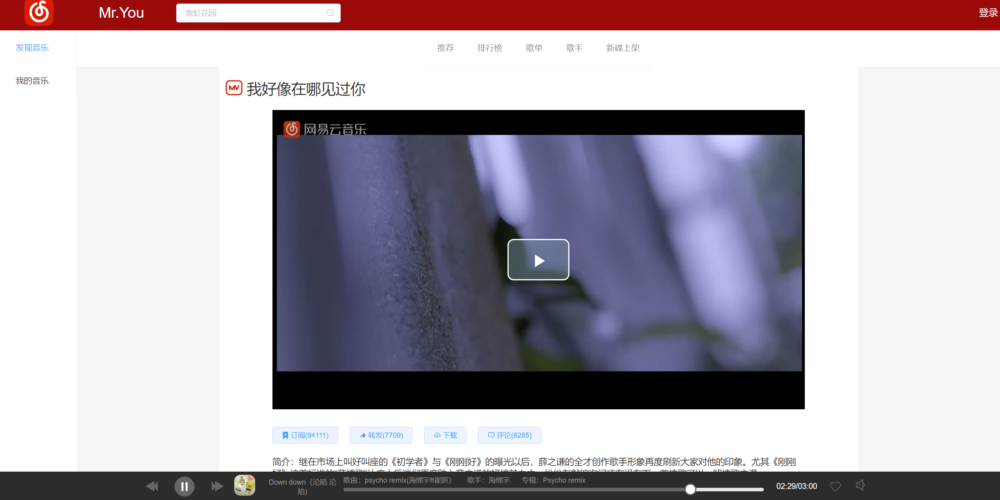

<!--
 * @Descripttion: 项目介绍
 * @Author: Mr.You
 * @Date: 2020-10-12 14:47:49
 * @LastEditTime: 2020-11-04 16:01:24
-->
# 使用Vue.js写的网易云音乐播放器

本人自学了Vue一年。当作练习，花了大概十天时间，参照网易云、QQ音乐、酷我音乐等音乐网站写了一个网易云音乐网站，支持搜索歌曲、MV、歌单等可以在线评论、回复点赞等功能。


在线演示：[http://49.4.79.236](http://49.4.79.236)

## 后台服务器

后台服务器是使用了网易云音乐 Node.js API service，大佬传送门：[https://github.com/Binaryify/NeteaseCloudMusicApi](https://github.com/Binaryify/NeteaseCloudMusicApi)

## 技术栈
- VueCli 项目框架
- Vue-Router 路由组件
- Axios 异步请求
- Vuex 全局状态管理
- ElementUi UI组件
- VideoPlayer MV播放组件
- Iconfont 字体图标库
  
## 功能

- 搜索：可以搜索歌手、歌曲、Mv、专辑、歌单
- 播放：支持播放列表、插入播放、上一首/下一首、歌词显示等
- 评论：支持在线评论、回复、点赞
- 我的音乐：需要登陆可以显示自己收藏的歌单等
- 其他：热门榜、歌手榜、新碟上架、歌单、推荐、歌单详情，MV详情，歌手详情，歌曲详情等

## 页面展示
- 首页：
  
- 排行榜：


- 歌单：


- 歌手列表：


- 新碟上架：


- 歌手详情：


- MV详情：


- 评论详情：


- 搜索详情： 

## 项目运行


```
# clone the project
git clone https://git.ahusmart.com/Mr.You/netease-cloud.git

# enter the project directory
cd NetEase cloud

# install dependency
npm install

# develop
npm run serve
```
## 总结
这个项目还有很多不足之处，希望大家多提意见，多多指教。衷心感谢提供后台接口的大佬。